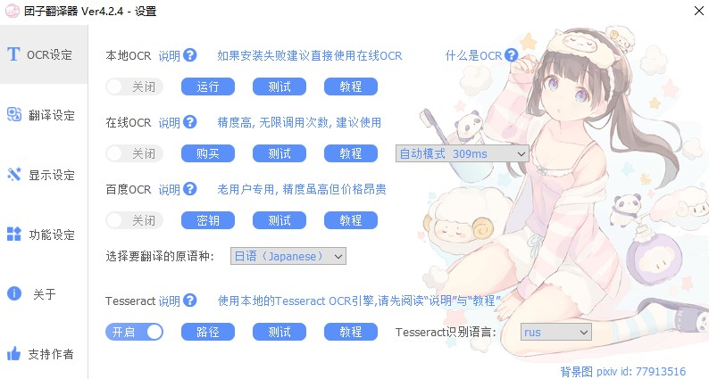
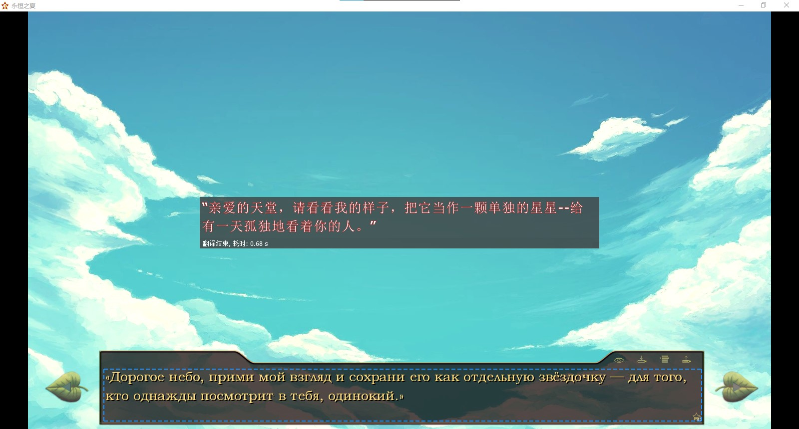
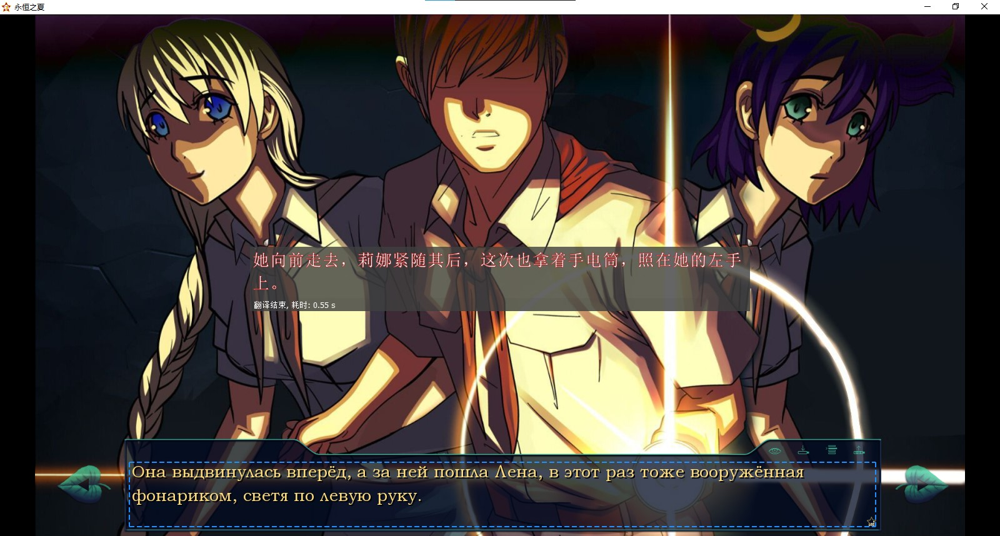

# 团子翻译器 + Tesseract OCR
基于[2022年7月29日PantsuDango/Dango-Translator主线分支](https://github.com/PantsuDango/Dango-Translator/tree/14c8d0bfb4d1398a84331f7765c74a4ba9b6b274)的魔改版本，为团子翻译器添加了使用离线OCR引擎Tesseract的接口。  
[Tesseract](https://github.com/tesseract-ocr/tesseract)是一款历史悠久的强大离线OCR引擎，可以识别[超过100种的语言](https://tesseract-ocr.github.io/tessdoc/Data-Files-in-different-versions.html)。现在用户可以使用团子翻译器中的Tesseract OCR来识别并翻译小语种了。

## 示例图片
> 
> 
> 

## 运行环境
- Windows
- Python3

## 安装方法
0. 加速安装Python包  
整个安装过程需要下载很多Python包。若在执行`pip install 包名称`时下载进度缓慢，可以使用国内的PyPi加速镜像。使用中科大镜像源加速的格式如下：
```
pip install 包名称 -i https://mirrors.ustc.edu.cn/pypi/web/simple
```

1. 打开`PowerShell`，创建一个Python虚拟环境  
我们即将安装一系列的Python包，为了让这些包和外界环境隔离，建议使用虚拟环境。如下命令执行完毕后，会在Windows的`C:\Users\用户名\`目录下创建一个`app_env`文件夹，里面存放着一个独立的Python虚拟环境。
```
pip install virtualenv
virtualenv $HOME/app_env
cd ~/app_env
```

2. 激活虚拟环境  
激活成功后命令行会出现`(app_env)`字样。接下来Python包都会被装进该环境，与外部环境隔离。
```
./Scripts/activate
```

3. 克隆或下载该项目  
把本项目的代码克隆或下载到当前虚拟环境目录；进入项目目录。
```
git clone --depth 1 https://github.com/NewComer00/Dango-Translator-tesseract
cd Dango-Translator-tesseract
```

4. 安装Python依赖包  
如果下载缓慢，记得按照第`0`步提示加速哟，在下述命令结尾加上`-i 镜像源链接`即可。
```
pip install -r ./requirements.txt
```

5. 运行程序  
程序内有比较完整的新功能教程，如果出现问题欢迎提出Issue。
```
python ./app.py
```

6. 退出虚拟环境  
如需退出虚拟环境，直接在命令行输入`deactivate`即可。关闭`PowerShell`时也会自动退出虚拟环境。

## 再次运行
首次安装完成后，如需再次运行，请打开`PowerShell`输入以下命令：
```
cd ~/app_env; ./Scripts/activate; cd ./Dango-Translator-tesseract; python ./app.py
```
